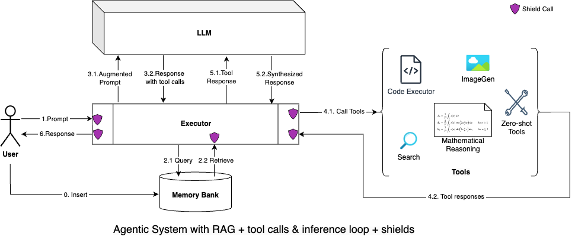

## Agentic API 101

This document talks about the Agentic APIs in Llama Stack. Starting Llama 3.1 you can build agentic applications capable of:

- breaking a task down and performing multi-step reasoning.
- using tools to perform some actions
  - built-in: the model has built-in knowledge of tools like search or code interpreter
  - zero-shot: the model can learn to call tools using previously unseen, in-context tool definitions
- providing system level safety protections using models like Llama Guard.

With Llama Stack, we now support the Agentic components to build a Agentic System based on our Agentic APIs.

### Agentic System Concept

In addition to the model lifecycle, we considered the different components involved in an agentic system. Specifically around tool calling and shields. Since the model may decide to call tools, a single model inference call is not enough. What’s needed is an agentic loop consisting of tool calls and inference. The model provides separate tokens representing end-of-message and end-of-turn. A message represents a possible stopping point for execution where the model can inform the execution environment that a tool call needs to be made. The execution environment, upon execution, adds back the result to the context window and makes another inference call. This process can get repeated until an end-of-turn token is generated.
Note that as of today, in the OSS world, such a “loop” is often coded explicitly via elaborate prompt engineering using a ReAct pattern (typically) or preconstructed execution graph. Llama 3.1 (and future Llamas) attempts to absorb this multi-step reasoning loop inside the main model itself.

**Let's consider an example:**
1. The user asks the system "Who played the NBA finals last year?"
2. The model "understands" that this question needs to be answered using web search. It answers this abstractly with a message of the form "Please call the search tool for me with the query: 'List finalist teams for NBA in the last year' ". Note that the model by itself does not call the tool (of course!)
3. The executor consults the set of tool implementations which have been configured by the developer to find an implementation for the "search tool". If it does not find it, it returns an error to the model. Otherwise, it executes this tool and returns the result of this tool back to the model.
4. The model reasons once again (using all the messages above) and decides to send a final response "In 2023, Denver Nuggets played against the Miami Heat in the NBA finals." to the executor
6. The executor returns the response directly to the user (since there is no tool call to be executed.)

The sequence diagram that details the steps is [here](https://github.com/meta-llama/llama-agentic-system/blob/main/docs/sequence-diagram.md).

* /memory_banks - to support creating multiple repositories of data that can be available for agentic systems
* /agentic_system - to support creating and running agentic systems. The sub-APIs support the creation and management of the steps, turns, and sessions within agentic applications.
  * /step - there can be inference, memory retrieval, tool call, or shield call steps
  * /turn - each turn begins with a user message and results in a loop consisting of multiple steps, followed by a response back to the user
  * /session - each session consists of multiple turns that the model is reasoning over
  * /memory_bank - a memory bank allows for the agentic system to perform retrieval augmented generation

### How to build your own agent

Agents Protocol is defined in [agents.py](../llama_stack/apis/agents/agents.py). Your agent class must have the following functions:

**create_agent(agent_config)**:

**create_agent_turn(agent_id,session_id,messages)**:

**get_agents_turn(agent_id, session_id, turn_id)**:

**get_agents_step(agent_id, session_id, turn_id, step_id)**:

**create_agent_session(agent_id, session_id)**

**get_agents_session(agent_id, session_id, turn_id)**

**delete_agents_session(agent_id, session_id)**

**delete_agents(agent_id, session_id)**

@runtime_checkable
class Agents(Protocol):
    @webmethod(route="/agents/create")
    async def create_agent(
        self,
        agent_config: AgentConfig,
    ) -> AgentCreateResponse: ...

    @webmethod(route="/agents/turn/create")
    async def create_agent_turn(
        self,
        agent_id: str,
        session_id: str,
        messages: List[
            Union[
                UserMessage,
                ToolResponseMessage,
            ]
        ],
        attachments: Optional[List[Attachment]] = None,
        stream: Optional[bool] = False,
    ) -> AgentTurnResponseStreamChunk: ...

    @webmethod(route="/agents/turn/get")
    async def get_agents_turn(
        self, agent_id: str, session_id: str, turn_id: str
    ) -> Turn: ...

    @webmethod(route="/agents/step/get")
    async def get_agents_step(
        self, agent_id: str, session_id: str, turn_id: str, step_id: str
    ) -> AgentStepResponse: ...

    @webmethod(route="/agents/session/create")
    async def create_agent_session(
        self,
        agent_id: str,
        session_name: str,
    ) -> AgentSessionCreateResponse: ...

    @webmethod(route="/agents/session/get")
    async def get_agents_session(
        self,
        agent_id: str,
        session_id: str,
        turn_ids: Optional[List[str]] = None,
    ) -> Session: ...

    @webmethod(route="/agents/session/delete")
    async def delete_agents_session(self, agent_id: str, session_id: str) -> None: ...

    @webmethod(route="/agents/delete")
    async def delete_agents(
        self,
        agent_id: str,
    ) -> None: ...
