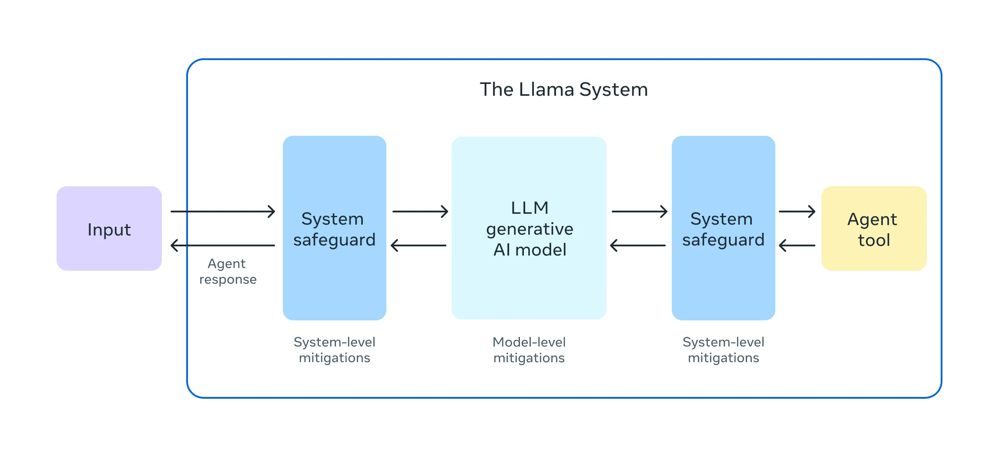

## Safety API 101

This document talks about the Safety APIs in Llama Stack.

As outlined in our [Responsible Use Guide](https://www.llama.com/docs/how-to-guides/responsible-use-guide-resources/), LLM apps should deploy appropriate system level safeguards to mitigate safety and security risks of LLM system, similar to the following diagram:


To that goal, Llama Stack uses **Prompt Guard** and **Llama Guard 3** to secure our system. Here are the quick introduction about them.

**Prompt Guard**:

PromptGuard is a classifier model trained on a large corpus of attacks, which is capable of detecting both explicitly malicious prompts (Jailbreaks) as well as prompts that contain injected inputs (Prompt Injections). We suggest a methodology of fine-tuning the model to application-specific data to achieve optimal results.

PromptGuard is a BERT model that outputs only labels; unlike LlamaGuard, it doesn't need a specific prompt structure or configuration. The input is a string that the model labels as safe or unsafe (at two different levels).

For more detail on PromptGuard, please checkout [PromptGuard model card and prompt formats](https://www.llama.com/docs/model-cards-and-prompt-formats/prompt-guard)

**Llama Guard 3**:

Llama Guard 3 comes in three flavors now: Llama Guard 3 1B, Llama Guard 3 8B and Llama Guard 3 11B-Vision. The first two models are text only, and the third supports the same vision understanding capabilities as the base Llama 3.2 11B-Vision model. All the models are multilingual–for text-only prompts–and follow the categories defined by the ML Commons consortium. Check their respective model cards for additional details on each model and its performance.

For more detail on Llama Guard 3, please checkout [Llama Guard 3 model card and prompt formats](https://www.llama.com/docs/model-cards-and-prompt-formats/llama-guard-3/)

**CodeShield**: We use [code shield](https://github.com/meta-llama/llama-stack/tree/f04b566c5cfc0d23b59e79103f680fe05ade533d/llama_stack/providers/impls/meta_reference/codeshield)

### Configure Safety

```bash
$ llama stack configure ~/.llama/distributions/conda/tgi-build.yaml

....
Configuring API: safety (meta-reference)
Do you want to configure llama_guard_shield? (y/n): y
Entering sub-configuration for llama_guard_shield:
Enter value for model (default: Llama-Guard-3-1B) (required):
Enter value for excluded_categories (default: []) (required):
Enter value for disable_input_check (default: False) (required):
Enter value for disable_output_check (default: False) (required):
Do you want to configure prompt_guard_shield? (y/n): y
Entering sub-configuration for prompt_guard_shield:
Enter value for model (default: Prompt-Guard-86M) (required):
....
```
As you can see, we did basic configuration above and configured:
- Llama Guard safety shield with model `Llama-Guard-3-1B`
- Prompt Guard safety shield with model `Prompt-Guard-86M`

you can test safety (if you configured llama-guard and/or prompt-guard shields) by:

```bash
python -m llama_stack.apis.safety.client localhost 5000
```
